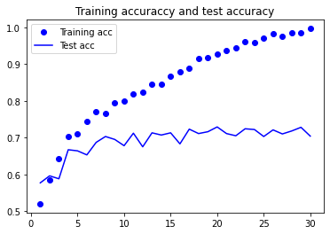
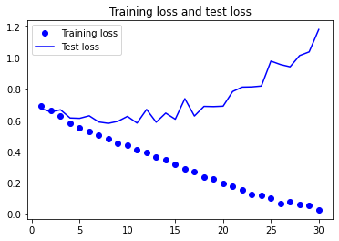

# Train Dogs and Cats classification using PyTorch from scratch
This repository shows Dogs and Cats classification using PyTorch from scratch.
Here I use convnet for dogs vs. cats classification. I shwos you how to write a
data a data loder from scratch and create a model. There are two different 
implementation for data loader. The first is from scratch and the second is 
using prebuilt "datasets.ImageFolder".

A keras implementation for this is given in the Book by "Deep learning with Python"
by Francois Chollet.

## Crete Virtual Environment
Create a virtiual environment.
```console
conda create conda create --name ml_env_1.11
conda activate ml_env_1.11
```
Install PyTorch
```console
conda install pytorch torchvision torchaudio cudatoolkit=11.3 -c pytorch
```
Install matplotlib
```console
conda install -c conda-forge matplotlib
```

## Data Prepration
Download data from https://www.kaggle.com/c/dogs-vs-cats/data and uncompress it.
Then execute data_prep.py to prepare train, test data directory with 2000 images
of dogs and cats.
```console
python data_prep.py
```

## Training
To train the model on extracted data execute the following command.
```console
python train.py
```

## Results


